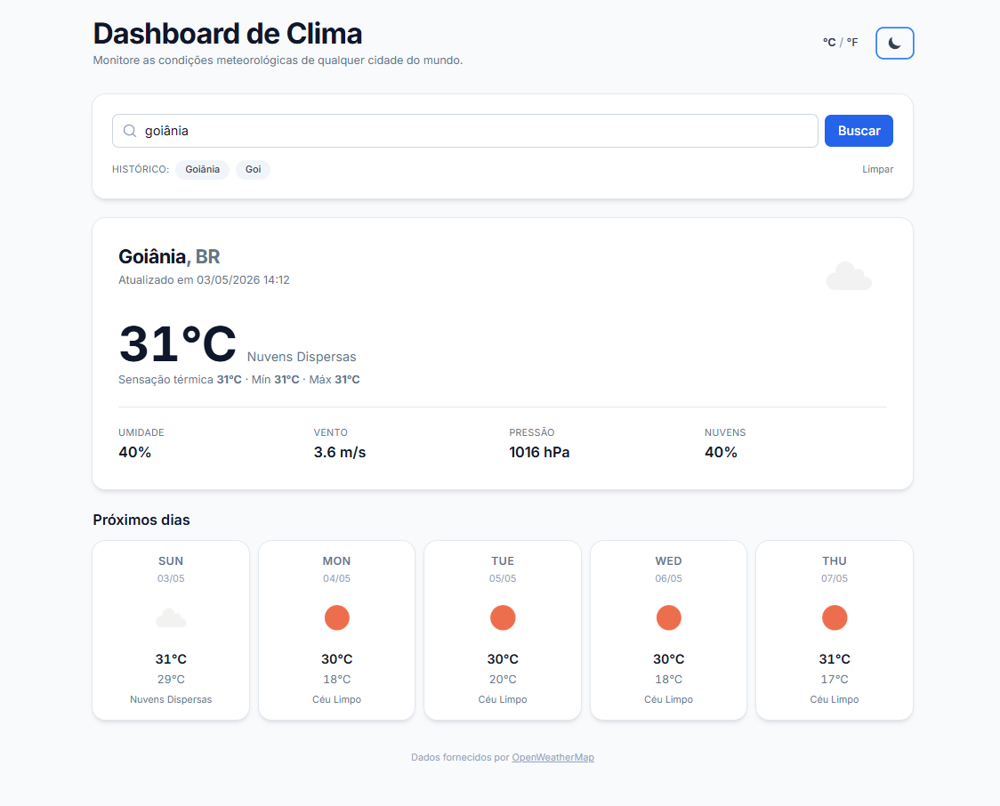
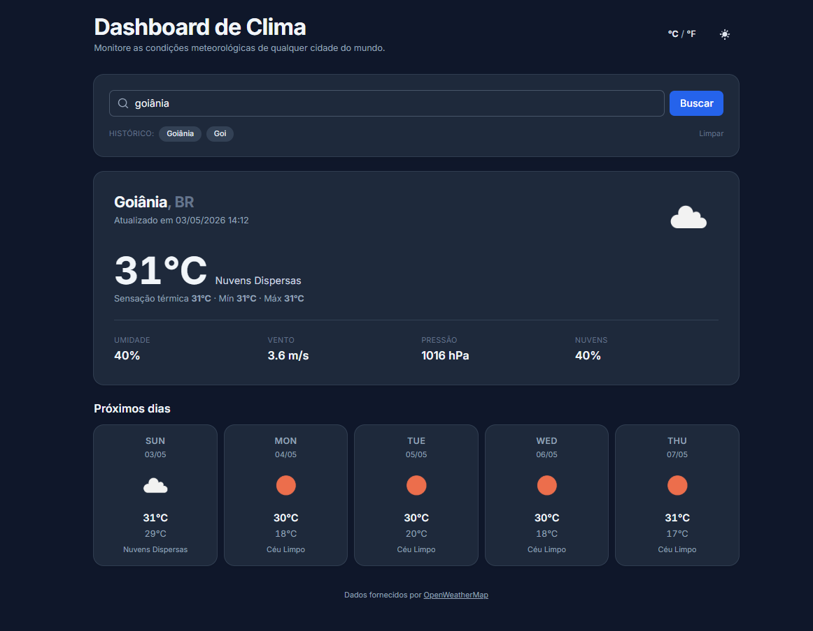
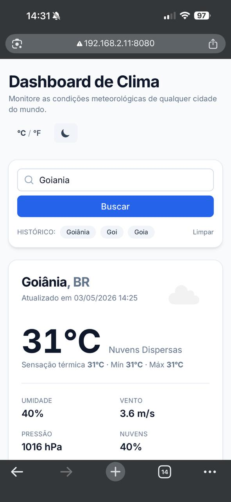
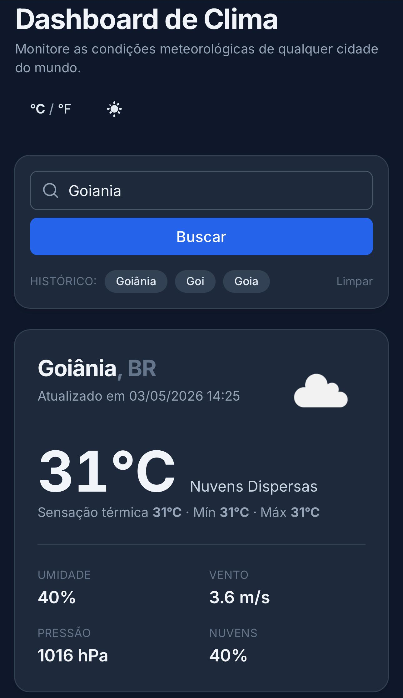

# Dashboard de Clima

[](.github/workflows/ci.yml)
[](https://angular.dev/)
[](LICENSE)
[](#testes)

Dashboard moderno de monitoramento meteorológico construído com **Angular 19**, **Signals**, **standalone components** e **Tailwind CSS**. Consome a API do [OpenWeatherMap](https://openweathermap.org/api) para exibir clima atual e previsão de 5 dias para qualquer cidade do mundo.

> Pronto para produção, com testes (Jasmine + Karma), lint (`angular-eslint`), formatação (Prettier) e CI (GitHub Actions).

## Sumário

- [Recursos](#recursos)
- [Capturas de tela](#capturas-de-tela)
- [Pré-requisitos](#pré-requisitos)
- [Configuração da API key](#configuração-da-api-key)
- [Como rodar](#como-rodar)
- [Rodando com Docker](#rodando-com-docker)
- [Comandos disponíveis](#comandos-disponíveis)
- [Estrutura do projeto](#estrutura-do-projeto)
- [Decisões arquiteturais](#decisões-arquiteturais)
- [Testes](#testes)
- [Estratégia de branches](#estratégia-de-branches)
- [Release](#release)
- [Contribuindo](#contribuindo)
- [Licença](#licença)

## Recursos

- 🔍 Busca por cidade com debounce de 400 ms (Reactive Forms + `takeUntilDestroyed`)
- 🌡️ Toggle Celsius ↔ Fahrenheit (computed signal + pipe `temperatureUnit`)
- 🌤️ Card principal: temperatura atual, sensação térmica, mín/máx, umidade, vento, pressão, cobertura de nuvens
- 📅 Previsão consolidada de **5 dias** (a API retorna intervalos de 3h, agrupados por dia)
- 🕘 Histórico das últimas 5 cidades, persistido em `localStorage` via `effect`
- 🌗 Tema claro/escuro com toggle, respeitando `prefers-color-scheme` na primeira visita
- 📱 Layout responsivo (mobile, tablet, desktop)
- ♿ Acessibilidade: ARIA labels, navegação por teclado, contraste WCAG AA
- ⚡ Lazy loading via `loadComponent`, `ChangeDetectionStrategy.OnPush` em todos os componentes
- 🧪 28 testes unitários, cobertura ≥ 70%

## Capturas de tela

Tema claro à esquerda, tema escuro à direita — toggle persistido em `localStorage`.

### Desktop

<p align="center">
  
  &#160;
  
</p>

### Mobile

<p align="center">
  
  &#160;
  
</p>

> Os arquivos vivem em [`docs/screenshots/`](docs/screenshots/). Nomes esperados: `dashboard-light.png`, `dashboard-dark.png`, `mobile-light.png`, `mobile-dark.png`.

## Pré-requisitos

| Ferramenta        | Versão mínima              |
| ----------------- | -------------------------- |
| Node.js           | **22 LTS** (≥ 20.11)       |
| npm               | **10+**                    |
| Angular CLI       | 19.x (instalada via `npx`) |
| Chrome / Chromium | para `ng test`             |

## Configuração da API key

1. Crie uma conta gratuita em <https://home.openweathermap.org/users/sign_up>.
2. Acesse <https://home.openweathermap.org/api_keys> e copie a chave _default_.
   > A chave pode levar **alguns minutos** até ficar ativa após a criação.
3. Copie o template de ambiente e preencha sua chave:

   ```bash
   cp src/environments/environment.example.ts src/environments/environment.ts
   ```

4. Abra `src/environments/environment.ts` e substitua `YOUR_OPENWEATHERMAP_API_KEY_HERE` pela sua chave.

> ⚠️ **Nunca commite** `src/environments/environment.ts` — ele já está listado no `.gitignore`.

## Como rodar

```bash
# 1. Instalar dependências
npm install

# 2. Configurar API key (ver seção acima)

# 3. Iniciar servidor de desenvolvimento (http://localhost:4200)
npm start
```

Build de produção:

```bash
npm run build:prod
# artefato em dist/dashboard-clima/
```

## Rodando com Docker

A imagem é multi-stage: a primeira etapa compila o bundle de produção com **Node 22 Alpine** e a segunda serve os arquivos estáticos via **nginx 1.27 Alpine** (com fallback de SPA, compressão gzip, cache imutável para bundles hashados e cabeçalhos de segurança).

### Pré-requisitos

- Docker 24+ (com BuildKit habilitado — o padrão atual)
- Docker Compose v2 (já incluído no Docker Desktop)

### 1. Configure a API key antes de buildar

O arquivo `src/environments/environment.ts` é lido **em tempo de build** (Angular faz tree-shaking dele dentro do bundle). Garanta que ele exista com sua chave válida:

```bash
cp src/environments/environment.example.ts src/environments/environment.ts
# edite o arquivo e cole sua chave em apiKey
```

> Se `environment.ts` não existir, o `Dockerfile` faz fallback automático para o template do `environment.example.ts` — útil para CI, mas o app não conseguirá consultar a API até você refazer o build com uma chave real.

### 2. Build + run com `docker compose` (recomendado)

```bash
# build da imagem e subida em segundo plano
docker compose up -d --build

# acesse em http://localhost:8080
```

A porta padrão do host é **8080**. Para mudar, use a variável `HOST_PORT`:

```bash
HOST_PORT=3000 docker compose up -d --build
```

Para parar e remover o container:

```bash
docker compose down
```

### 3. Build + run usando apenas `docker`

```bash
# build
docker build -t dashboard-clima:latest .

# run
docker run --rm -p 8080:80 --name clima dashboard-clima:latest

# acesse em http://localhost:8080
```

### O que está incluído na imagem

| Camada     | Ferramenta            | Tamanho aprox. |
| ---------- | --------------------- | -------------- |
| Build      | `node:22-alpine`      | descartada     |
| Runtime    | `nginx:1.27-alpine`   | ~50 MB         |
| Bundle SPA | dist/dashboard-clima/ | ~85 KB gzipped |

### Configuração do nginx

O arquivo [nginx.conf](nginx.conf) inclui:

- **SPA fallback** — qualquer rota desconhecida (`/about`, `/cidade/lisbon`, etc.) cai em `index.html` para o Angular Router assumir.
- **Cache imutável de 1 ano** para arquivos hashados (`*.js`, `*.css`, fontes, imagens).
- **`Cache-Control: no-store`** em `index.html` — cada deploy é entregue imediatamente.
- **Gzip** para assets de texto.
- Headers de segurança: `X-Content-Type-Options`, `X-Frame-Options`, `Referrer-Policy`.

### Healthcheck

Tanto o `Dockerfile` quanto o `docker-compose.yml` definem healthcheck via `wget --spider http://localhost/`. Verifique com:

```bash
docker ps               # coluna STATUS exibe (healthy)
docker inspect dashboard-clima | grep -A 5 Health
```

### Logs e troubleshooting

```bash
docker compose logs -f web         # acompanhar requests do nginx em tempo real
docker compose exec web sh         # shell dentro do container
docker compose exec web nginx -t   # validar nginx.conf
```

Se a tela ficar em branco após o deploy: a chave provavelmente está incorreta. Veja o painel **Network** do navegador — chamadas `401` indicam chave inválida, `404` indicam cidade não encontrada.

### Deploy em produção

A imagem é stateless e roda em qualquer plataforma de container — Kubernetes, ECS, Cloud Run, Fly.io, Railway, Render. Coisas a considerar:

- **HTTPS** — termine TLS num ingress/load balancer na frente do container, não no nginx interno.
- **Rotação da API key** — como a chave fica embutida no bundle, qualquer rotação exige novo build + redeploy. Para chaves "secretas de verdade", proxie a API através de um backend próprio em vez de chamar do navegador.
- **Variáveis de runtime** — se você quiser injetar config sem rebuildar, troque o `environment.ts` estático por um `assets/config.json` carregado via `APP_INITIALIZER`.

## Comandos disponíveis

| Comando                 | Descrição                                    |
| ----------------------- | -------------------------------------------- |
| `npm start`             | Servidor de desenvolvimento na porta 4200    |
| `npm run build`         | Build de produção (default)                  |
| `npm run build:prod`    | Build de produção otimizado                  |
| `npm run watch`         | Build em modo watch (desenvolvimento)        |
| `npm test`              | Roda os testes em ChromeHeadless (sem watch) |
| `npm run test:watch`    | Testes em modo watch                         |
| `npm run test:coverage` | Testes + relatório de cobertura              |
| `npm run lint`          | Executa ESLint                               |
| `npm run lint:fix`      | Aplica fixes automáticos                     |
| `npm run format`        | Formata `src/` com Prettier                  |
| `npm run format:check`  | Apenas verifica formatação                   |

## Estrutura do projeto

```
dashboard-clima/
├── .github/workflows/ci.yml         # Pipeline GitHub Actions
├── src/
│   ├── app/
│   │   ├── core/                    # Models, tokens, service, interceptor
│   │   │   ├── models/
│   │   │   │   ├── weather.model.ts
│   │   │   │   └── forecast.model.ts
│   │   │   ├── tokens/api-config.token.ts
│   │   │   ├── interceptors/api-key.interceptor.ts
│   │   │   └── services/weather.service.ts
│   │   ├── features/dashboard/      # Feature dashboard (lazy loaded)
│   │   ├── shared/                  # Componentes e pipes reutilizáveis
│   │   │   ├── components/
│   │   │   │   ├── search-bar/
│   │   │   │   ├── weather-card/
│   │   │   │   ├── forecast-card/
│   │   │   │   ├── spinner/
│   │   │   │   └── error-message/
│   │   │   └── pipes/temperature-unit.pipe.ts
│   │   ├── app.component.ts
│   │   ├── app.config.ts
│   │   └── app.routes.ts
│   ├── environments/
│   │   ├── environment.example.ts   # Template (commitado)
│   │   └── environment.ts           # Local (NÃO commitar)
│   ├── styles.css                   # Tailwind + tokens de design
│   ├── index.html
│   └── main.ts
├── Dockerfile                       # Build multi-stage (Node 22 + nginx)
├── docker-compose.yml               # Orquestração local
├── nginx.conf                       # SPA fallback, cache, gzip, security
├── .dockerignore
├── karma.conf.js                    # Configuração de testes + thresholds
├── tailwind.config.js
├── eslint.config.js
├── .prettierrc
├── tsconfig.json                    # strict + strictTemplates
├── angular.json
├── package.json
├── CHANGELOG.md
├── LICENSE
└── README.md
```

## Decisões arquiteturais

### Por que **standalone components** em vez de NgModules?

Caminho oficial recomendado pelo Angular desde a v17. Reduzem boilerplate, deixam dependências explícitas no campo `imports`, melhoram tree-shaking e facilitam lazy loading via `loadComponent`.

### Por que **Signals** em vez de `BehaviorSubject`/RxJS para estado local?

Signals são síncronos, têm zero dependência em zone, integram-se com `computed` e `effect` para reatividade declarativa, e abrem caminho para _zoneless change detection_. Para fluxos assíncronos contínuos ainda usamos RxJS (ex.: `valueChanges` do form com debounce).

### Por que **`inject()`** em vez de constructor injection?

- Funciona em funções (interceptors, guards, resolvers).
- Permite herança sem repetir `super()` com argumentos.
- Estilo consistente em componentes, services e factories.

### Por que **functional interceptor**?

Interceptors funcionais são a API moderna (`provideHttpClient(withInterceptors([...]))`). Mais leves, testáveis e composáveis que a interface `HttpInterceptor`.

### Por que **`InjectionToken<ApiConfig>`** para configuração da API?

Isola o service do detalhe de build (`environment.ts`). Em testes, basta sobrescrever o token com um config mock — sem precisar de `TestBed.overrideProvider` em múltiplos lugares.

### Por que **agrupar a forecast por dia no cliente**?

A API `/forecast` retorna 40 itens (8 por dia, intervalos de 3h). Para o uso "previsão de 5 dias", o componente precisa de um item por dia. Agrupar no service mantém o template simples e a tipagem (`ForecastDay`) honesta.

## Testes

Stack: **Jasmine + Karma + ChromeHeadless**.

```bash
npm run test:coverage
```

Relatório HTML em `coverage/dashboard-clima/index.html`. Thresholds (configurados em [karma.conf.js](karma.conf.js)):

| Métrica    | Mínimo |
| ---------- | ------ |
| Statements | 70%    |
| Lines      | 70%    |
| Functions  | 70%    |
| Branches   | 60%    |

Cobertura atual da última execução: **statements 90%, lines 94%, functions 81%, branches 63%**.

## Estratégia de branches

- `main`: branch principal — sempre deployável, protegida (requer PR + CI verde).
- `feature/<nome>`: trabalho em desenvolvimento.
- `fix/<nome>`: correções pontuais.
- `chore/<nome>`: configurações, dependências, documentação.

Commits seguem [Conventional Commits](https://www.conventionalcommits.org/pt-br/v1.0.0/) (`feat:`, `fix:`, `chore:`, `test:`, `docs:`, `style:`, `ci:`).

## Release

Versão atual: **`v1.0.0`** (tag já criada localmente — veja [CHANGELOG.md](CHANGELOG.md)).

Para publicar a tag no remoto:

```bash
git push origin v1.0.0
# ou, se houver outras tags pendentes:
git push origin --tags
```

Para próximas versões, siga [SemVer](https://semver.org/lang/pt-BR/) e atualize o `CHANGELOG.md` antes de criar a tag:

```bash
# 1. Atualize CHANGELOG.md com a nova versão
# 2. Bump da versão no package.json
npm version <patch|minor|major> --no-git-tag-version
# 3. Commit e tag
git commit -am "chore: release vX.Y.Z"
git tag -a vX.Y.Z -m "Release vX.Y.Z"
git push origin main --follow-tags
```

## Contribuindo

1. Faça fork e crie uma branch: `git checkout -b feature/minha-feature`.
2. Garanta que `npm run lint`, `npm test` e `npm run build` passam.
3. Use Conventional Commits.
4. Abra um PR descrevendo motivação e mudanças.

## Licença

> 📚 **Projeto acadêmico** — desenvolvido como entrega de **Pós-Graduação**, distribuído livremente para fins educacionais.

Permissões e restrições estão descritas no arquivo [LICENSE](LICENSE):

- ✅ Estudo, leitura, cópia e modificação para uso **acadêmico** e **educacional não comercial**.
- ✅ Citação como referência em trabalhos acadêmicos, mantendo o crédito ao autor.
- ❌ Uso comercial sem autorização expressa do autor.
- ❌ Reapresentação como entrega avaliativa em outros cursos sem citar a fonte e indicar as alterações.

> O software é fornecido "no estado em que se encontra", sem garantias de qualquer natureza.

Desenvolvido com apoio de Claude (Opus 4.7). Dados meteorológicos fornecidos por [OpenWeatherMap](https://openweathermap.org/).
