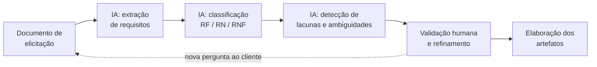
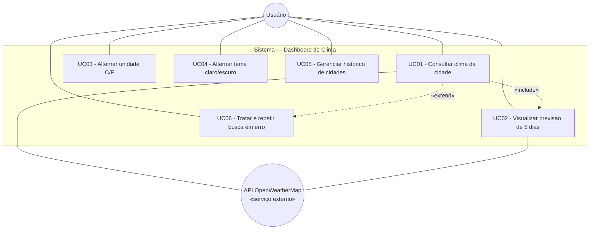
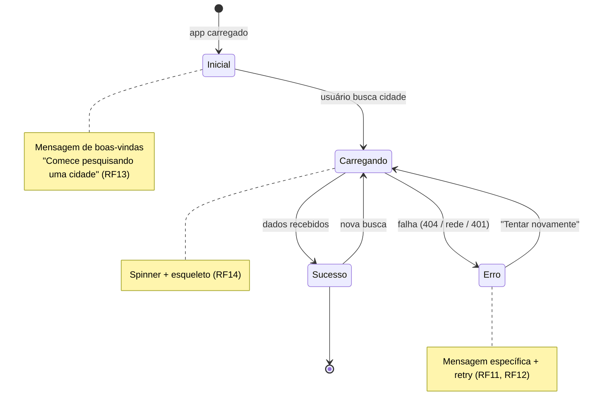

# Análise de Requisitos com Apoio de IA Generativa — Dashboard de Clima

> **Atividade prática de Engenharia de Requisitos**
> Análise de um documento de elicitação, identificação de requisitos, regras de negócio, requisitos não funcionais, lacunas e ambiguidades — com apoio de Inteligência Artificial Generativa — e elaboração dos artefatos de especificação mais adequados.

---

## Identificação

| Campo | Conteúdo |
| --- | --- |
| **Disciplina** | Engenharia de Requisitos / Especificação de Software |
| **Curso** | Pós-Graduação |
| **Aluno(a)** | _[preencher]_ |
| **Sistema analisado** | Dashboard de Clima (`dashboard-clima`) |
| **Ferramenta de IA Generativa** | Claude (Anthropic) |
| **Data** | _[preencher]_ |

---

## Sumário

1. [Introdução e objetivo](#1-introdução-e-objetivo)
2. [Metodologia — como a IA Generativa foi utilizada](#2-metodologia--como-a-ia-generativa-foi-utilizada)
3. [Documento analisado (insumo da elicitação)](#3-documento-analisado-insumo-da-elicitação)
4. [Análise assistida por IA](#4-análise-assistida-por-ia)
   - [4.1 Requisitos Funcionais (RF)](#41-requisitos-funcionais-rf)
   - [4.2 Regras de Negócio (RN)](#42-regras-de-negócio-rn)
   - [4.3 Requisitos Não Funcionais (RNF)](#43-requisitos-não-funcionais-rnf)
   - [4.4 Lacunas identificadas](#44-lacunas-identificadas)
   - [4.5 Ambiguidades identificadas](#45-ambiguidades-identificadas)
5. [Artefatos de especificação selecionados](#5-artefatos-de-especificação-selecionados)
   - [5.1 Justificativa da escolha dos artefatos](#51-justificativa-da-escolha-dos-artefatos)
   - [5.2 Diagrama de Casos de Uso](#52-diagrama-de-casos-de-uso)
   - [5.3 Especificação de Casos de Uso](#53-especificação-de-casos-de-uso)
   - [5.4 Histórias de Usuário e critérios de aceitação](#54-histórias-de-usuário-e-critérios-de-aceitação)
   - [5.5 Protótipo / Wireframe](#55-protótipo--wireframe)
6. [Matriz de rastreabilidade](#6-matriz-de-rastreabilidade)
7. [Considerações finais e reflexão sobre o uso de IA](#7-considerações-finais-e-reflexão-sobre-o-uso-de-ia)

---

## 1. Introdução e objetivo

Este trabalho aplica técnicas de **Engenharia de Requisitos** sobre um documento produzido na etapa de **elicitação** de um sistema web de monitoramento meteorológico — o **Dashboard de Clima**. O sistema, uma _Single Page Application_ (SPA) em Angular, consome a API pública do [OpenWeatherMap](https://openweathermap.org/api) para exibir o clima atual e a previsão de cinco dias de qualquer cidade do mundo.

O objetivo da atividade é:

1. **Analisar** um documento de elicitação (transcrição de entrevista com o cliente/idealizador);
2. Utilizar **IA Generativa como apoio** para **identificar** requisitos funcionais, regras de negócio, requisitos não funcionais, **lacunas** e **ambiguidades**;
3. **Selecionar e elaborar** os artefatos de especificação mais adequados para representar a solução.

> **Observação metodológica.** O papel da IA aqui é de **copiloto de análise**: ela acelera a extração e a organização dos requisitos e aponta inconsistências, mas todas as decisões, classificações e validações são de responsabilidade do analista. A IA sugere; o engenheiro de requisitos decide.

---

## 2. Metodologia — como a IA Generativa foi utilizada

A análise seguiu um fluxo iterativo de _prompting_ estruturado sobre o documento de elicitação:



| Etapa | Prompt-guia utilizado (resumo) | Papel do analista |
| --- | --- | --- |
| Extração | _"Liste tudo o que o cliente disse que o sistema deve fazer."_ | Conferir cobertura, remover ruído |
| Classificação | _"Separe em requisitos funcionais, regras de negócio e requisitos não funcionais, justificando."_ | Corrigir classificações limítrofes |
| Qualidade | _"Aponte trechos ambíguos, vagos ou incompletos e o que ficou sem definição."_ | Priorizar o que virará pergunta ao cliente |
| Especificação | _"Sugira e elabore os artefatos mais adequados para este escopo."_ | Escolher o conjunto e validar consistência |

**Boas práticas adotadas com a IA:**

- **Rastreabilidade da origem:** cada requisito registra a fala que o originou (coluna _Origem_).
- **Verificação cruzada:** as sugestões da IA foram confrontadas com o comportamento real do sistema.
- **Ceticismo com "alucinações":** requisitos não fundamentados no documento foram descartados ou reclassificados como _lacuna_ (algo a confirmar com o cliente), nunca inventados como fato.

---

## 3. Documento analisado (insumo da elicitação)

> Este é o documento **bruto** produzido na elicitação — uma **transcrição de entrevista** entre a analista e o idealizador do produto. Ele é propositalmente informal e contém imprecisões, que serão tratadas na Seção 4. Os trechos entre colchetes `[E1]…[En]` são marcações do analista para rastreabilidade.

---

**ATA / TRANSCRIÇÃO DE ENTREVISTA — Levantamento de requisitos**
**Projeto:** Painel de Clima
**Participantes:** Analista (A) · Cliente/Idealizador (C)
**Duração:** 40 min

> **A:** Me conta o que você imagina para esse painel.

> **C:** Eu queria um site simples onde a pessoa digita o nome de uma cidade e vê o clima de agora. `[E1]` Tipo, a temperatura, se está chovendo, essas coisas. `[E2]` E também queria ver os próximos dias, uma previsão. `[E3]`

> **A:** Quando você diz "o clima de agora", quais informações você gostaria de mostrar?

> **C:** A temperatura principal, e uma sensação térmica que às vezes é diferente. `[E4]` Umidade, o vento… `[E5]` Ah, e um ícone bonitinho representando se está sol ou nublado. `[E6]` Quanto mais completo melhor, mas sem poluir a tela.

> **A:** E a previsão dos próximos dias, quantos dias?

> **C:** Uns dias aí, uma semaninha. `[E7]` O suficiente pra pessoa se programar. Um cartão por dia, com a mínima e a máxima. `[E8]`

> **A:** A busca — como você imagina que a pessoa procura a cidade?

> **C:** Ela digita e o sistema já vai buscando, sem precisar ficar clicando em botão toda hora. `[E9]` Mas também tem que ter um botão de buscar, né. `[E10]` E seria bom lembrar as últimas cidades que a pessoa pesquisou, pra ela clicar rápido de novo. `[E11]`

> **A:** Lembrar por quanto tempo? As últimas quantas?

> **C:** Ah, as últimas que ela usou. Não precisa ser muita coisa. `[E11]`

> **A:** Sobre unidades de temperatura?

> **C:** A maioria aqui usa Celsius, mas tem gente que gosta de Fahrenheit. Deixa a pessoa trocar. `[E12]`

> **A:** E visual?

> **C:** Tem que ser bonito e funcionar no celular também, muita gente vai abrir no telefone. `[E13]` E se der pra ter aquele modo escuro, que cansa menos a vista, seria ótimo. `[E14]` Que ele já abra do jeito que o celular da pessoa está, claro ou escuro. `[E15]`

> **A:** Idioma?

> **C:** Português, é para o público daqui. `[E16]`

> **A:** E se a pessoa digitar uma cidade que não existe, ou a internet cair?

> **C:** Precisa avisar direitinho, sem quebrar a tela. `[E17]` Uma mensagem amigável e um jeito de tentar de novo. `[E18]`

> **A:** Sobre desempenho e disponibilidade?

> **C:** Tem que ser rápido, ninguém tem paciência. `[E19]` E preciso que rode em qualquer lugar sem dor de cabeça pra instalar. `[E20]` Ah, e como é trabalho de faculdade, precisa ter testes e ficar organizado pra eu apresentar. `[E21]`

> **A:** Vai ter login, cadastro de usuário?

> **C:** Por enquanto não, é aberto pra qualquer um usar. `[E22]`

> **A:** Perfeito, acho que tenho o suficiente para começar.

---

## 4. Análise assistida por IA

### 4.1 Requisitos Funcionais (RF)

> _O que o sistema deve **fazer** — comportamentos observáveis._

| ID | Requisito | Prioridade¹ | Origem |
| --- | --- | --- | --- |
| **RF01** | Permitir que o usuário pesquise o clima informando o nome de uma cidade. | Essencial | E1, E9, E10 |
| **RF02** | Buscar automaticamente enquanto o usuário digita (busca reativa), sem exigir clique. | Importante | E9 |
| **RF03** | Disponibilizar também acionamento explícito da busca por botão/_Enter_. | Importante | E10 |
| **RF04** | Exibir o clima atual da cidade: temperatura, sensação térmica, mínima/máxima, umidade, vento, pressão, cobertura de nuvens, visibilidade, nascer e pôr do sol. | Essencial | E1, E2, E4, E5 |
| **RF05** | Exibir um ícone/descrição textual representando a condição do tempo (sol, nuvens, chuva). | Importante | E6 |
| **RF06** | Exibir a previsão dos próximos dias, um cartão por dia, com mínima e máxima. | Essencial | E3, E7, E8 |
| **RF07** | Permitir alternar a unidade de temperatura entre Celsius e Fahrenheit. | Importante | E12 |
| **RF08** | Manter e exibir um histórico das cidades pesquisadas recentemente, com seleção rápida. | Importante | E11 |
| **RF09** | Permitir limpar o histórico de cidades. | Desejável | E11 (derivado) |
| **RF10** | Permitir alternar entre tema claro e escuro. | Importante | E14 |
| **RF11** | Exibir mensagens de erro amigáveis e específicas (cidade não encontrada, sem conexão, chave inválida). | Essencial | E17 |
| **RF12** | Oferecer ação de "tentar novamente" após um erro. | Importante | E18 |
| **RF13** | Exibir estado inicial de boas-vindas quando nenhuma busca foi feita ainda. | Desejável | E1 (derivado) |
| **RF14** | Exibir indicador de carregamento durante a consulta à API. | Importante | E19 (derivado) |

¹ Prioridade segundo MoSCoW simplificado: Essencial (_Must_), Importante (_Should_), Desejável (_Could_).

---

### 4.2 Regras de Negócio (RN)

> _Restrições e políticas que **condicionam** o comportamento dos requisitos funcionais._

| ID | Regra de Negócio | Aplica-se a | Origem |
| --- | --- | --- | --- |
| **RN01** | A busca só é disparada para termos com **no mínimo 2 caracteres**. | RF01, RF02 | E9 (refinado) |
| **RN02** | A busca reativa aplica _debounce_ de **400 ms** e ignora repetições consecutivas do mesmo termo, para evitar chamadas excessivas à API. | RF02 | E9, E19 |
| **RN03** | O histórico armazena no máximo **5 cidades**, ordenadas da mais recente para a mais antiga. | RF08 | E11 (refinado) |
| **RN04** | O histórico **não guarda cidades duplicadas** (comparação sem diferenciar maiúsculas/minúsculas); uma nova busca de cidade já presente a move para o topo. | RF08 | E11 (derivado) |
| **RN05** | A previsão exibe **5 dias**. Como a fonte retorna medições a cada 3 h, os dados são **agrupados por dia**; a medição das **12h** representa o dia (com _fallback_ para a primeira do dia). | RF06 | E7, E8 (refinado) |
| **RN06** | A mínima e a máxima do dia são o **menor** e o **maior** valor entre as medições daquele dia; umidade e vento são a **média** do dia. | RF06 | E8 (derivado) |
| **RN07** | A **unidade padrão** é Celsius; a fonte é sempre consultada em métrico e a conversão para Fahrenheit é feita no cliente. | RF07 | E12 (refinado) |
| **RN08** | Na primeira visita, o tema inicial **respeita a preferência do sistema operacional** (`prefers-color-scheme`); depois, prevalece a escolha do usuário. | RF10 | E15 |
| **RN09** | As preferências de **unidade**, **tema** e o **histórico** persistem localmente no navegador (entre sessões, no mesmo dispositivo). | RF07, RF08, RF10 | E11, E12, E14 (derivado) |
| **RN10** | O idioma dos dados e da interface é **Português (Brasil)**. | RF04, RF05 | E16 |

---

### 4.3 Requisitos Não Funcionais (RNF)

> _Atributos de **qualidade** e restrições do sistema (ISO/IEC 25010)._

| ID | Requisito Não Funcional | Categoria | Origem |
| --- | --- | --- | --- |
| **RNF01** | A interface deve ser **responsiva**, funcionando em celular, tablet e desktop. | Usabilidade / Portabilidade | E13 |
| **RNF02** | Oferecer **tema escuro** e claro para conforto visual. | Usabilidade | E14 |
| **RNF03** | Tempo de resposta percebido baixo; feedback imediato de carregamento e busca com _debounce_. | Desempenho | E19 |
| **RNF04** | O sistema deve ser **acessível** (rótulos ARIA, navegação por teclado, contraste WCAG AA). | Acessibilidade | E13 (derivado / boa prática) |
| **RNF05** | Interface e mensagens em **Português (Brasil)**. | Usabilidade / i18n | E16 |
| **RNF06** | Falhas (rede, cidade inexistente, credencial inválida) devem ser tratadas **sem quebrar a interface**, com mensagem clara. | Confiabilidade / Robustez | E17, E18 |
| **RNF07** | O sistema deve ser **facilmente executável e implantável** (empacotamento em container, sem instalação complexa). | Portabilidade / Implantação | E20 |
| **RNF08** | Deve haver **testes automatizados** com cobertura mínima definida (≥ 70%). | Manutenibilidade / Qualidade | E21 |
| **RNF09** | O código deve ser **organizado e legível**, adequado a apresentação acadêmica (padrões de projeto, lint, formatação). | Manutenibilidade | E21 |
| **RNF10** | A disponibilidade dos dados depende de um **serviço externo de terceiros** (OpenWeatherMap); o sistema deve degradar graciosamente quando ele estiver indisponível. | Confiabilidade / Restrição | E17 (derivado) |
| **RNF11** | O acesso é **público/anônimo**, sem autenticação nesta versão. | Segurança / Restrição | E22 |

---

### 4.4 Lacunas identificadas

> _Informações **ausentes** no documento que o analista precisa **confirmar com o cliente** antes de especificar completamente. A IA foi usada para sinalizar o que o cliente não disse — não para inventar a resposta._

| ID | Lacuna | Impacto | Pergunta a levar ao cliente |
| --- | --- | --- | --- |
| **L01** | Nada foi dito sobre **cidades homônimas** (ex.: "Springfield", ou "São Paulo" cidade vs. estado). | Médio | Como desambiguar? Mostrar país/estado, lista de sugestões? |
| **L02** | **Comportamento offline** e ausência de rede não foram detalhados além de "avisar". | Médio | Deve haver cache do último resultado para exibição offline? |
| **L03** | **Retenção do histórico** não foi definida (por quanto tempo? persiste entre dispositivos?). | Baixo | Confirmar limite (assumido 5) e escopo (assumido local). |
| **L04** | **Geolocalização** ("clima da minha localização atual") não foi mencionada. | Médio | É desejável detectar a cidade automaticamente? |
| **L05** | **Limites de uso da API** (plano gratuito tem teto de requisições/minuto) não foram tratados. | Alto | Como reagir ao estouro do limite (HTTP 429)? Cache? Fila? |
| **L06** | **Privacidade / LGPD** do histórico e preferências armazenados no navegador. | Baixo | É necessário aviso de armazenamento local ao usuário? |
| **L07** | **Alertas meteorológicos**, favoritos ou notificações não foram citados. | Baixo | Fazem parte de versões futuras (fora do escopo atual)? |
| **L08** | **Critérios objetivos de desempenho** ("rápido") não foram quantificados. | Médio | Definir meta (ex.: resposta < 2 s em 3G, bundle < 200 KB). |
| **L09** | **Segurança da chave de API**: numa SPA a chave fica exposta no navegador. | Alto | Aceita o risco (uso acadêmico) ou exige _backend proxy_? |
| **L10** | **Navegadores/dispositivos suportados** não foram delimitados. | Baixo | Definir matriz mínima de suporte. |

---

### 4.5 Ambiguidades identificadas

> _Trechos **presentes** no documento, porém **imprecisos ou interpretáveis de mais de uma forma**. Foram resolvidos por decisão de projeto (com premissa explícita) ou marcados para validação._

| ID | Trecho ambíguo | Interpretações possíveis | Resolução adotada |
| --- | --- | --- | --- |
| **A01** | "os próximos dias / uma semaninha" `[E7]` | 3, 5 ou 7 dias | **5 dias** — limite prático da fonte gratuita (RN05). Validar com cliente. |
| **A02** | "essas coisas / quanto mais completo melhor" `[E2]` | Conjunto de campos indefinido | Definido escopo fechado de campos em **RF04**. |
| **A03** | "lembrar as últimas cidades" `[E11]` | Quantidade e ordem indefinidas | **5 cidades, mais recente no topo, sem duplicatas** (RN03, RN04). |
| **A04** | "tem que ser rápido" `[E19]` | Métrica subjetiva | Traduzido em RNF03; **quantificação pendente** (ver L08). |
| **A05** | "funcionar no celular" `[E13]` | Só celular? Quais tamanhos? | Interpretado como **responsivo mobile/tablet/desktop** (RNF01). |
| **A06** | "em português" `[E16]` | Só PT-BR ou multi-idioma? | **Somente PT-BR** nesta versão (RN10, RNF05). |
| **A07** | "ícone bonitinho" `[E6]` | Estético e subjetivo | Traduzido em requisito objetivo (ícone + descrição textual, RF05). |
| **A08** | "rode em qualquer lugar sem dor de cabeça" `[E20]` | Multiplataforma? Web? Instalável? | Interpretado como **empacotamento em container** (RNF07). |
| **A09** | "modo escuro… que já abra do jeito do celular" `[E14, E15]` | Automático sempre ou só na 1ª vez? | **Automático na primeira visita; escolha do usuário prevalece depois** (RN08). |

---

## 5. Artefatos de especificação selecionados

### 5.1 Justificativa da escolha dos artefatos

Para um sistema deste porte — **interativo, centrado no usuário, de escopo bem delimitado e sem regras transacionais complexas** — foram selecionados três artefatos complementares, cada um cobrindo uma dimensão diferente da especificação:

| Artefato | Por que foi escolhido | O que ele captura melhor |
| --- | --- | --- |
| **Diagrama + Especificação de Casos de Uso** | Comunica de forma visual e textual **quem** faz **o quê** com o sistema; excelente para validar escopo com o cliente. | Interações ator↔sistema, fluxos principais e de exceção (essenciais dado o peso de RNF06/RF11). |
| **Histórias de Usuário + Critérios de Aceitação** | Formato ágil, ideal para requisitos **orientados a valor** e para tornar cada RF **testável**; casa com a exigência de testes (RNF08). | Valor para o usuário e condições objetivas de "pronto" (Given-When-Then). |
| **Protótipo / Wireframe** | Sistema é fortemente **visual e de UI**; um esboço resolve várias ambiguidades de layout (A05, A07) melhor que texto. | Estrutura das telas, disposição dos componentes e estados (vazio, carregando, erro, sucesso). |

**Artefatos deliberadamente não utilizados:** diagrama de sequência detalhado e modelo entidade-relacionamento foram considerados **desnecessários** — não há persistência em banco de dados (só `localStorage`) nem orquestração de múltiplos serviços que justifique o custo desses artefatos. Preferiu-se a **economia de modelagem**: especificar apenas o que agrega valor.

---

### 5.2 Diagrama de Casos de Uso



> **Legenda.** `UC01` inclui `UC02` (a mesma busca traz clima atual **e** previsão). `UC06` (tratamento/repetição de erro) **estende** `UC01`, pois só ocorre no fluxo de exceção. `UC01` e `UC02` dependem do ator externo **API OpenWeatherMap**.

---

### 5.3 Especificação de Casos de Uso

#### UC01 — Consultar clima da cidade

| Campo | Descrição |
| --- | --- |
| **Ator principal** | Usuário |
| **Atores de apoio** | API OpenWeatherMap (serviço externo) |
| **Objetivo** | Obter as condições meteorológicas atuais de uma cidade. |
| **Pré-condições** | Aplicação carregada; conexão com a internet disponível. |
| **Pós-condições** | Clima atual e previsão exibidos; cidade adicionada ao histórico. |
| **Requisitos relacionados** | RF01–RF06, RF14; RN01, RN02, RN05–RN07, RN10 |

**Fluxo principal**

1. O usuário digita o nome de uma cidade (≥ 2 caracteres) `[RN01]`.
2. O sistema aguarda 400 ms de inatividade e ignora repetições `[RN02]`.
3. O sistema exibe o indicador de carregamento `[RF14]`.
4. O sistema requisita **clima atual** e **previsão** à API (em paralelo).
5. A API retorna os dados.
6. O sistema normaliza e exibe o cartão de clima atual `[RF04, RF05]`.
7. O sistema exibe a previsão de 5 dias (**inclui UC02**) `[RF06]`.
8. O sistema adiciona a cidade ao topo do histórico `[RN03, RN04]`.

**Fluxos alternativos / de exceção** (**estende UC06**)

- **A1 — Cidade não encontrada (HTTP 404):** o sistema exibe _"Cidade não encontrada."_ e mantém a tela estável `[RF11, RNF06]`.
- **A2 — Sem conexão (HTTP 0):** o sistema exibe _"Sem conexão com a API. Verifique sua internet."_ e oferece **Tentar novamente** `[RF12]`.
- **A3 — Chave inválida (HTTP 401):** o sistema exibe _"Chave de API inválida."_.
- **A4 — Falha desconhecida:** o sistema exibe mensagem genérica e oferece nova tentativa.

---

#### UC05 — Gerenciar histórico de cidades

| Campo | Descrição |
| --- | --- |
| **Ator principal** | Usuário |
| **Objetivo** | Reutilizar buscas recentes e controlar o histórico. |
| **Pré-condições** | Pelo menos uma cidade pesquisada com sucesso. |
| **Pós-condições** | Histórico atualizado e persistido localmente `[RN09]`. |
| **Requisitos relacionados** | RF08, RF09; RN03, RN04, RN09 |

**Fluxo principal**

1. Após uma busca bem-sucedida, o sistema registra a cidade no histórico (máx. 5, sem duplicatas) `[RN03, RN04]`.
2. O usuário clica em uma cidade do histórico.
3. O sistema executa **UC01** para a cidade selecionada.

**Fluxo alternativo**

- **A1 — Limpar histórico:** o usuário aciona "Limpar"; o sistema esvazia e persiste a lista vazia `[RF09]`.

---

### 5.4 Histórias de Usuário e critérios de aceitação

> Formato: **Como** `<papel>`, **quero** `<ação>`, **para** `<benefício>`. Critérios em **Gherkin** (Dado / Quando / Então).

---

**US01 — Consultar clima por cidade** `(RF01, RF04)`

> **Como** um usuário curioso sobre o tempo, **quero** digitar o nome de uma cidade e ver o clima atual, **para** decidir como me preparar para o dia.

```gherkin
Cenário: Busca de cidade válida
  Dado que estou na tela inicial
  Quando digito "Lisboa" e confirmo a busca
  Então vejo a temperatura atual, a sensação térmica, a umidade e o vento
  E vejo um ícone representando a condição do tempo

Cenário: Termo muito curto
  Dado que estou na tela inicial
  Quando digito apenas "L"
  Então nenhuma busca é disparada
```

---

**US02 — Ver a previsão dos próximos dias** `(RF06, RN05)`

> **Como** usuário, **quero** ver a previsão dos próximos dias, **para** me programar para a semana.

```gherkin
Cenário: Previsão de 5 dias
  Dado que busquei uma cidade válida
  Quando os dados são carregados
  Então vejo 5 cartões, um por dia
  E cada cartão mostra a temperatura mínima e a máxima do dia
```

---

**US03 — Alternar unidade de temperatura** `(RF07, RN07)`

> **Como** usuário, **quero** alternar entre Celsius e Fahrenheit, **para** ler a temperatura na unidade que me é familiar.

```gherkin
Cenário: Trocar para Fahrenheit
  Dado que vejo "20°C"
  Quando aciono o alternador de unidade
  Então a mesma temperatura passa a ser exibida em "°F"
  E a preferência é lembrada na próxima visita
```

---

**US04 — Reutilizar buscas recentes** `(RF08, RN03, RN04)`

> **Como** usuário recorrente, **quero** ver e reutilizar as últimas cidades pesquisadas, **para** consultá-las rapidamente sem redigitar.

```gherkin
Cenário: Histórico sem duplicatas e limitado
  Dado que pesquisei 6 cidades diferentes
  Então o histórico exibe apenas as 5 mais recentes
  E a cidade mais recente aparece em primeiro

Cenário: Reuso pelo histórico
  Dado que "Tokyo" está no histórico
  Quando clico em "Tokyo"
  Então o clima de "Tokyo" é carregado novamente
```

---

**US05 — Tema claro/escuro automático** `(RF10, RN08)`

> **Como** usuário, **quero** que o app respeite o tema do meu dispositivo e me deixe trocar, **para** ter conforto visual.

```gherkin
Cenário: Tema inicial segue o sistema
  Dado que meu sistema está em modo escuro
  Quando abro o app pela primeira vez
  Então a interface aparece em tema escuro

Cenário: Escolha do usuário prevalece
  Dado que troquei manualmente para o tema claro
  Quando recarrego a página
  Então a interface permanece em tema claro
```

---

**US06 — Tratamento amigável de erros** `(RF11, RF12, RNF06)`

> **Como** usuário, **quero** mensagens claras quando algo dá errado e uma forma de tentar de novo, **para** não ficar travado numa tela quebrada.

```gherkin
Cenário: Cidade inexistente
  Dado que estou na tela inicial
  Quando busco "Xyzabc"
  Então vejo a mensagem "Cidade não encontrada."
  E a interface continua utilizável

Cenário: Sem internet
  Dado que estou sem conexão
  Quando tento buscar uma cidade
  Então vejo um aviso de falha de conexão
  E vejo um botão "Tentar novamente"
```

---

### 5.5 Protótipo / Wireframe

Wireframe de **baixa fidelidade** da tela principal (desktop), resolvendo as ambiguidades A05 (responsividade) e A07 (ícone + descrição).

```text
┌───────────────────────────────────────────────────────────────┐
│  Dashboard de Clima                          [ °C | °F ]  [ ☾ ] │
│  Monitore as condições de qualquer cidade do mundo.            │
├───────────────────────────────────────────────────────────────┤
│  ┌─────────────────────────────────────────┐  ┌────────────┐  │
│  │ 🔍  Digite o nome de uma cidade…         │  │  Buscar    │  │
│  └─────────────────────────────────────────┘  └────────────┘  │
│  Histórico:  (Lisboa) (Tokyo) (São Paulo) (Porto)     Limpar  │
├───────────────────────────────────────────────────────────────┤
│  ┌───────────────────── CLIMA ATUAL ──────────────────────┐   │
│  │  Lisboa, PT                         🌤️  Parcialmente    │   │
│  │  22°C   (sensação 21°C)                 nublado         │   │
│  │  min 17°   max 25°                                      │   │
│  │  Umidade 60%  · Vento 12 km/h · Pressão 1015 hPa       │   │
│  │  Nuvens 40%   · Visib. 10 km · ☀ 07:12  · ☾ 20:41     │   │
│  └────────────────────────────────────────────────────────┘   │
│                                                               │
│  Próximos dias                                                │
│  ┌──────┐ ┌──────┐ ┌──────┐ ┌──────┐ ┌──────┐               │
│  │ Seg  │ │ Ter  │ │ Qua  │ │ Qui  │ │ Sex  │               │
│  │ 🌤️   │ │ 🌧️   │ │ ☀️   │ │ ☁️   │ │ 🌤️   │               │
│  │18°/26°│ │16°/21°│ │19°/28°│ │17°/24│ │18°/25│               │
│  └──────┘ └──────┘ └──────┘ └──────┘ └──────┘               │
├───────────────────────────────────────────────────────────────┤
│              Dados fornecidos por OpenWeatherMap              │
└───────────────────────────────────────────────────────────────┘
```

**Estados da interface especificados** (cobrindo RF13, RF14, RF11):



**Notas de responsividade (RNF01):** no celular, o cabeçalho empilha em coluna, a busca ocupa a largura total e os cartões de previsão passam de 5 colunas para 2. Todos os controles mantêm rótulos ARIA e são navegáveis por teclado (RNF04).

---

## 6. Matriz de rastreabilidade

> Liga cada necessidade do cliente aos requisitos e aos artefatos que a especificam — garantindo **cobertura** (nada do que o cliente pediu ficou sem tratamento) e **ausência de requisitos órfãos**.

| Origem (fala) | Requisito(s) | Regra(s) | Artefato(s) |
| --- | --- | --- | --- |
| E1, E9, E10 | RF01, RF02, RF03 | RN01, RN02 | UC01, US01, Wireframe |
| E2, E4, E5, E6 | RF04, RF05 | RN10 | UC01, US01, Wireframe |
| E3, E7, E8 | RF06 | RN05, RN06 | UC01/UC02, US02, Wireframe |
| E11 | RF08, RF09 | RN03, RN04, RN09 | UC05, US04 |
| E12 | RF07 | RN07, RN09 | US03 |
| E14, E15 | RF10 | RN08, RN09 | US05 |
| E17, E18 | RF11, RF12 | — | UC06, US06, Diagrama de estados |
| E13 | RNF01, RNF04 | — | Wireframe |
| E16 | RNF05 | RN10 | US01 |
| E19 | RNF03, RF14 | RN02 | Diagrama de estados |
| E20 | RNF07 | — | — (decisão de arquitetura) |
| E21 | RNF08, RNF09 | — | — (critério de qualidade) |
| E22 | RNF11 | — | Diagrama de casos de uso |

---

## 7. Considerações finais e reflexão sobre o uso de IA

**Sobre o objeto de estudo.** O documento de elicitação, embora curto, mostrou-se **rico em imprecisões típicas** de uma conversa real com o cliente: pedidos vagos ("uma semaninha", "bonitinho", "rápido"), quantidades indefinidas ("as últimas cidades") e silêncios importantes (nada sobre limite de API, cidades homônimas ou segurança da chave). A análise transformou uma transcrição informal em **14 RF, 10 RN, 11 RNF, 10 lacunas e 9 ambiguidades** rastreáveis.

**Sobre o uso da IA Generativa.** A IA foi eficaz como **acelerador cognitivo** em três frentes:

1. **Extração exaustiva** — reduziu o risco de esquecer requisitos implícitos (ex.: estado de carregamento, estado vazio), derivados de falas indiretas.
2. **Classificação e padronização** — organizou os itens em RF/RN/RNF com nomenclatura e IDs consistentes, e gerou os artefatos em formato uniforme.
3. **Pensamento crítico assistido** — foi particularmente útil para **apontar lacunas e ambiguidades**, questionando o que o cliente _não_ disse (segurança da chave, LGPD, limite de requisições).

**Limites observados.** A IA tende a "preencher silêncios" com suposições plausíveis — por isso foi essencial a **validação humana**: suposições foram rebaixadas a **lacunas a confirmar** (em vez de fatos), e cada requisito foi **rastreado até uma fala** do cliente. A IA **não substitui** a conversa de refinamento com o cliente; ela a **prepara**, entregando uma lista objetiva de perguntas (Seção 4.4).

**Conclusão.** O fluxo _elicitação → análise assistida por IA → validação humana → especificação_ mostrou-se produtivo e auditável. A combinação de **casos de uso** (visão de interação), **histórias de usuário com critérios** (visão de valor e teste) e **protótipo** (visão de interface) cobre as dimensões relevantes deste sistema **sem excesso de modelagem**, respeitando o princípio de que o artefato existe para **comunicar e reduzir incerteza** — não para cumprir formalidade.

---

> _Documento elaborado como atividade prática de Engenharia de Requisitos, com apoio de IA Generativa (Claude). Sistema de referência: `dashboard-clima`. Dados meteorológicos: OpenWeatherMap._
