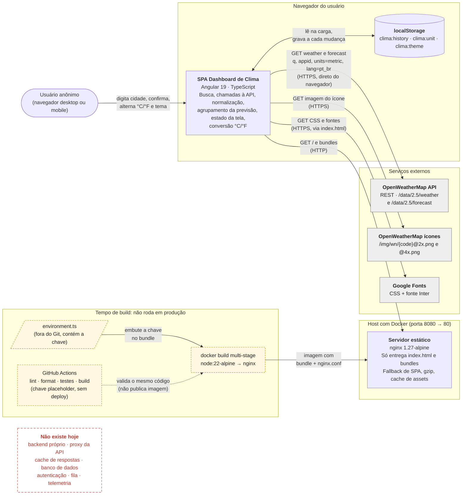
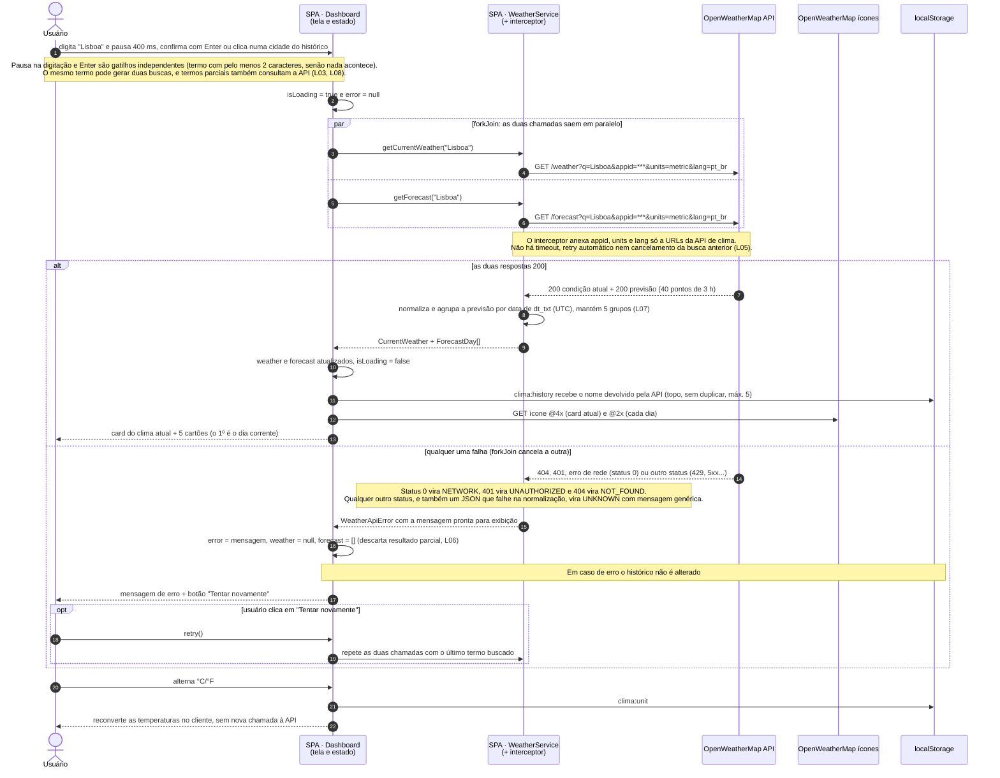

# Dashboard de Clima: arquitetura como código

Documentação arquitetural do **Dashboard de Clima**, escrita para servir de contexto a
agentes de desenvolvimento, com diagramas em Mermaid gerados por IA generativa e depois
confrontados com o código real.

- **Código documentado:** a aplicação deste repositório, no commit [`6bc8a92`](https://github.com/lfdeus/dashboard-clima-pos/tree/6bc8a92). Os links de evidência apontam para esse commit, para não mudarem se o código evoluir
- **O que os diagramas mostram:** o sistema **como está hoje**, com defeitos e tudo, e não o estado idealizado
- **Convenção:** o que não traz a marca *Hipótese* foi lido no código. Hipóteses ficam
  marcadas e ligadas a uma lacuna. Nenhuma suposição aparece no diagrama como fato.

## Sumário

1. [Visão geral e escopo](#1-visão-geral-e-escopo)
2. [Containers: limites e responsabilidades](#2-containers-limites-e-responsabilidades)
3. [Integrações externas](#3-integrações-externas)
4. [Restrições](#4-restrições)
5. [Diagrama estrutural: containers](#5-diagrama-estrutural-containers)
6. [Diagrama comportamental: consultar o clima de uma cidade](#6-diagrama-comportamental-consultar-o-clima-de-uma-cidade)
7. [Invariantes arquiteturais](#7-invariantes-arquiteturais)
8. [Lacunas conhecidas](#8-lacunas-conhecidas)
9. [O que a IA inferiu, o que foi ajustado e por quê](#9-o-que-a-ia-inferiu-o-que-foi-ajustado-e-por-quê)
10. [Divergências conscientes](#10-divergências-conscientes)
11. [O que ainda falta para um agente construir sem inventar](#11-o-que-ainda-falta-para-um-agente-construir-sem-inventar)
12. [Como usar este repositório](#12-como-usar-este-repositório)

---

## 1. Visão geral e escopo

**O que é.** Aplicação web de página única (SPA) para consultar o clima atual e a previsão
dos próximos dias de qualquer cidade, a partir do nome digitado. Qualquer pessoa com
navegador pode usar, sem cadastro nem login. É um projeto acadêmico e não tem operação em
produção.

**Nível da visão.** Containers, inspirado no C4 nível 2, mais uma jornada crítica. A
visão não desce a componentes visuais: o sistema é pequeno e isso não se justificaria. A
única exceção é o diagrama de sequência, que separa a SPA em *tela* e *serviço* para
mostrar em que camada fica cada regra (INV02).

| Dentro do escopo | Fora do escopo (não existe no código) |
| --- | --- |
| Busca por nome de cidade, ao digitar (debounce) ou ao confirmar | Contas de usuário, login, autorização |
| Clima atual: temperatura, sensação térmica, mín/máx, umidade, vento, pressão, nuvens, ícone e descrição | Favoritos, alertas, notificações |
| Previsão com um cartão por dia (5 cartões) | Geolocalização, mapas, séries históricas |
| Alternância °C/°F e tema claro/escuro | Backend próprio, proxy da API, banco de dados |
| Histórico das 5 últimas cidades, no navegador | Cache de respostas, fila, telemetria |
| Mensagens de erro com "Tentar novamente" | Ambiente de produção e pipeline de deploy |

## 2. Containers: limites e responsabilidades

| Container | Tecnologia | Responsabilidade | O que **não** faz |
| --- | --- | --- | --- |
| **SPA Dashboard de Clima** | Angular 19, TypeScript, Tailwind. Roda no navegador do usuário | Toda a lógica: dispara a busca, chama a API, traduz erros, normaliza os dados, agrupa a previsão por dia, converte °C/°F e guarda o estado da tela | Não guarda nada em servidor e não protege a chave de API |
| **localStorage** | Web Storage do navegador | Guarda `clima:history`, `clima:unit` e `clima:theme` ([schema](contratos/localstorage.schema.json)) | Não sincroniza entre dispositivos e não expira |
| **Servidor estático** | nginx 1.27-alpine em Docker, porta 80 exposta como 8080 | Entrega `index.html` e os bundles, com fallback de SPA, gzip, cache longo para assets e `no-store` no `index.html` | Não faz proxy, não tem lógica de negócio e não termina TLS |
| **Build** *(não roda em produção)* | `docker build` multi-stage (Node 22 → nginx) e GitHub Actions | O `docker build` embute a chave de `environment.ts` no bundle. O CI roda lint, formatação, testes e build com a chave placeholder | O CI não publica imagem nem faz deploy |

## 3. Integrações externas

| Serviço | Quem chama | Como | Dados trafegados | Falhas tratadas |
| --- | --- | --- | --- | --- |
| **OpenWeatherMap API** (`/data/2.5/weather` e `/data/2.5/forecast`) | O navegador, direto | HTTPS GET com `q`, `appid`, `units=metric` e `lang=pt_br` na query ([contrato consumido](contratos/openweathermap-consumido.openapi.yaml)) | Termo buscado, chave de API e IP do usuário | 0 → `NETWORK`, 401 → `UNAUTHORIZED`, 404 → `NOT_FOUND`, qualquer outro → `UNKNOWN` |
| **OpenWeatherMap ícones** (`/img/wn/{code}@2x.png` e `@4x.png`) | O navegador, via `` | HTTPS GET, sem chave | Código do ícone e IP do usuário | Nenhuma: se a imagem falhar, aparece o texto alternativo |
| **Google Fonts** | O navegador, via `<link>` no `index.html` | HTTPS GET | IP do usuário | Nenhuma: o CSS cai na fonte de reserva |

## 4. Restrições

- **Sem backend próprio.** A chave de API é embutida no bundle em tempo de build e vai na
  query string de toda requisição. Trocar a chave exige novo build (L04).
- **Plano gratuito da OpenWeatherMap.** Previsão de no máximo 5 dias, em pontos de 3 horas.
  Existe um limite de requisições, mas o valor não foi levantado (L03).
- **Idioma.** Interface e dados em português do Brasil (INV10).
- **Acesso anônimo.** Não há autenticação.
- **Implantação.** Imagem Docker multi-stage. Não existe ambiente de produção definido (L10).
- **Metas de qualidade.** Não há metas de desempenho, disponibilidade ou volume (L01, L02).
  Por isso nenhum número dessa natureza aparece nos diagramas.

## 5. Diagrama estrutural: containers

Fonte: [`diagrams/containers.mmd`](diagrams/containers.mmd).



**Simplificações deliberadas:** ficaram de fora o favicon e os demais assets estáticos,
os detalhes de CORS e o actor "pessoa desenvolvedora". A caixa *Não existe hoje* não é
um container: está no diagrama para que um agente não acrescente essas peças "por boas
práticas" sem uma decisão.

## 6. Diagrama comportamental: consultar o clima de uma cidade

Fonte: [`diagrams/consultar-clima-sequence.mmd`](diagrams/consultar-clima-sequence.mmd).
É a jornada crítica: sem ela, o sistema não entrega nada. O diagrama mostra os ramos de
sucesso, de erro e de "tentar novamente".



**Simplificações deliberadas:** ficaram de fora o skeleton de carregamento, a
alternância de tema e a ordem exata em que os ícones carregam (cada cartão pede o seu,
em paralelo). Os problemas de concorrência (L05) aparecem em nota, e não como fluxo,
porque dependem de tempo e não de uma sequência fixa.

## 7. Invariantes arquiteturais

Regras que um agente **não pode mudar em silêncio**. A lista completa, com a evidência de
cada uma no código, está em [`invariantes.md`](invariantes.md).

- **INV01**: não existe backend. A SPA chama a API direto e o nginx só serve arquivos.
- **INV02**: a tela não conhece status HTTP. A tradução para `WeatherApiError` acontece no service.
- **INV03**: só o interceptor anexa a chave, e só em URLs da API de clima.
- **INV04**: a API é sempre chamada em unidades métricas. °F é conversão de apresentação.
- **INV05**: clima atual e previsão aparecem juntos ou não aparecem.
- **INV06**: o histórico grava só em caso de sucesso, com o nome devolvido pela API, no máximo 5, sem duplicatas.
- **INV07**: o estado persiste só no `localStorage`, com chaves e formato fixos.
- **INV08**: o arquivo com a chave nunca é versionado.
- **INV09**: busca com no mínimo 2 caracteres e debounce de 400 ms.
- **INV10**: interface em pt-BR. **Hoje está violada** (D01).

## 8. Lacunas conhecidas

Pontos ainda não decididos. A tabela completa, com o comportamento atual e a pergunta a
decidir, está em [`lacunas.md`](lacunas.md).

| ID | Lacuna | ID | Lacuna |
| --- | --- | --- | --- |
| L01 | Metas de desempenho | L08 | Termo parcial dispara consulta e polui o histórico |
| L02 | Degradação quando a API cai | L09 | Cidades homônimas |
| L03 | Limite de requisições e reação ao 429 | L10 | Ambiente de produção |
| L04 | Proteção da chave de API | L11 | Observabilidade |
| L05 | Concorrência entre buscas (sem cancelamento) | L12 | Privacidade: fontes, IP e histórico |
| L06 | Resultado parcial descartado | L13 | Cabeçalhos de segurança efetivos (*hipótese*) |
| L07 | Fuso horário da previsão (UTC) | L14 | `localStorage` indisponível (*hipótese*) |

## 9. O que a IA inferiu, o que foi ajustado e por quê

### Método

1. A descrição em linguagem natural foi escrita no nível de containers, sem detalhes de
   implementação: [`geracao-ia/prompt.md`](geracao-ia/prompt.md).
2. Um modelo **sem acesso ao código** gerou os dois diagramas e listou 20 suposições.
   A resposta está guardada sem edição em
   [`geracao-ia/resposta-bruta.md`](geracao-ia/resposta-bruta.md).
3. Cada elemento gerado foi conferido no código (commit `6bc8a92`). O que não era verdade
   foi corrigido, e o que não dava para confirmar virou lacuna ou hipótese marcada.

### O que o modelo inferiu corretamente

Várias regras que **não estavam na descrição** batem com o código:

- As duas chamadas saem **em paralelo** e no modo **tudo ou nada**, que é exatamente o
  `forkJoin` do código.
- O histórico **grava só em caso de sucesso**, sem duplicatas (sem diferenciar
  maiúsculas), no máximo 5, com o mais recente primeiro.
- Na primeira visita, o tema segue o `prefers-color-scheme`.
- "Tentar novamente" aparece **em todos os erros**, até no 404, e não há retentativa
  automática, backoff nem cache.
- Um termo com menos de 2 caracteres não chama a API, e clicar no histórico dispara a
  mesma jornada.
- Alternar °C/°F não gera nova chamada.
- A chave fica exposta no bundle, e o CI não publica imagem.
- **Nenhum container foi inventado:** não apareceu cache, fila nem backend "por boas
  práticas".

### O que foi ajustado

O erro típico do modelo aqui **não foi acrescentar peças**. Foi desenhar o comportamento que
o sistema *deveria* ter. Cada suposição abaixo é uma boa prática, e nenhuma existe no
código. Um agente que lesse o diagrama gerado acreditaria que o sistema já é robusto: não
corrigiria os defeitos e ainda escreveria código em cima de garantias que não existem.

| # | O modelo gerou | O código faz | Ajuste | Por que importa para um agente |
| --- | --- | --- | --- | --- |
| A01 | "cancela consulta pendente" (padrão `switchMap`) | Não cancela. Cada busca abre uma assinatura nova e o campo continua habilitado durante o carregamento. [↗](https://github.com/lfdeus/dashboard-clima-pos/blob/6bc8a92/src/app/features/dashboard/dashboard.component.ts#L98-L123) | Removido do diagrama. Virou nota e **L05** | É o ajuste mais importante: a boa prática suposta escondia uma condição de corrida real |
| A02 | "sem resposta em 10 s" (timeout) | Não há timeout | Removido. A nota diz "não há timeout" | É um **RNF inventado** dentro do diagrama. A suposição 11 admite o número, mas ele entrou no desenho sem marcação |
| A03 | Debounce "de cerca de 500 ms" e "Enter dispara na hora" | 400 ms. Enter dispara na hora, **e** a digitação dispara de novo depois do debounce: duas buscas e 4 requisições. [↗](https://github.com/lfdeus/dashboard-clima-pos/blob/6bc8a92/src/app/features/dashboard/dashboard.component.html#L44-L49) | 400 ms (INV09) e nota sobre os gatilhos independentes (**L03**) | Consumo em dobro de uma cota que nem foi levantada |
| A04 | Previsão agrupada "por dia local da cidade usando o `timezone`" | Agrupa pela data de `dt_txt`, em **UTC**. O `timezone` é lido e ignorado. [↗](https://github.com/lfdeus/dashboard-clima-pos/blob/6bc8a92/src/app/core/services/weather.service.ts#L67-L97) | Diagrama mostra "UTC". Virou **L07** | O modelo supôs o jeito certo e escondeu uma lacuna de regra de negócio |
| A05 | Ramos separados para 429, 5xx/timeout e payload inválido, cada um com sua mensagem | Qualquer status fora de 0, 401 e 404, ou falha na normalização, vira `UNKNOWN` com a mensagem genérica. [↗](https://github.com/lfdeus/dashboard-clima-pos/blob/6bc8a92/src/app/core/services/weather.service.ts#L99-L117) | Ramo único com a tradução real (INV02). 429 virou **L03** | Um agente implementaria a UI esperando códigos de erro que o service não emite |
| A06 | 401 → "Serviço de clima indisponível no momento" | 401 → "Chave de API inválida. Confira o environment.ts." | Diagrama mostra o comportamento real. Registrado como **D06** | O texto do modelo é melhor, mas um diagrama "como está" não pode corrigir o código às escondidas |
| A07 | Fallback para "ícone genérico" quando o ícone falha | Não existe. O navegador mostra o texto alternativo (a descrição) | Ramo removido | Comportamento inexistente |
| A08 | "Falhas ao gravar no `localStorage` são ignoradas" | Só a leitura do histórico está protegida. [↗](https://github.com/lfdeus/dashboard-clima-pos/blob/6bc8a92/src/app/features/dashboard/dashboard.component.ts#L56-L70) | Ramo removido. Virou **L14** (*hipótese*) | O modelo prometeu uma tolerância a falhas que o código não tem |
| A09 | Suposição 16: "o vento passa de m/s para mph" junto com °F | O vento fica sempre em m/s | Registrado no contrato consumido | Suposição "por analogia" que um agente implementaria |
| A10 | SPA, nginx e `localStorage` na mesma caixa "Sistema" | A SPA e o `localStorage` rodam no **dispositivo do usuário**, e o nginx em outro host | Criadas as fronteiras *Navegador do usuário* e *Host com Docker* | É a fronteira de confiança: a chave e o estado ficam no navegador, e o nginx não participa das chamadas à API |
| A11 | SPA como participante único na sequência | A regra de erro fica no service, e o estado e o histórico na tela | SPA dividida em *Dashboard* e *WeatherService* | Mostra a camada de cada regra, para um agente não duplicá-la |
| A12 | Nada sobre o que **não** existe | Não há backend, proxy, cache, banco, auth, fila nem telemetria | Caixa explícita *Não existe hoje* | Impede que um agente acrescente essas peças "por boas práticas" |

**Lição sobre o processo.** O modelo listou honestamente as 20 suposições, mas várias
foram parar no diagrama sem marcação (A01, A02, A04). Quem consome só o `.mmd`, como um
agente, não vê essa lista. Por isso a regra adotada aqui é: o diagrama só tem fato lido
no código, e o que não é fato vira lacuna numerada, citada no diagrama pelo ID (L03,
L05, L07).

## 10. Divergências conscientes

Divergências entre o código, os requisitos e o README da aplicação. Os diagramas seguem o
**código**, e cada divergência fica registrada aqui para não virar uma "correção" feita em
silêncio.

| ID | Divergência | Evidência | Encaminhamento |
| --- | --- | --- | --- |
| **D01** | Os cartões da previsão mostram **SUN, MON, TUE**: não há `LOCALE_ID` pt-BR registrado, então a data sai em inglês. Viola RN10 e INV10 | [`forecast-card.component.ts#L18-L20`](https://github.com/lfdeus/dashboard-clima-pos/blob/6bc8a92/src/app/shared/components/forecast-card/forecast-card.component.ts#L18-L20) e o [screenshot](https://github.com/lfdeus/dashboard-clima-pos/blob/6bc8a92/docs/screenshots/dashboard-light.png) do próprio repositório | Defeito. Corrigir está alinhado com a arquitetura |
| **D02** | O RF04 pede visibilidade e nascer/pôr do sol. O service lê esses campos, mas o card não mostra | [`weather-card.component.ts#L52-L71`](https://github.com/lfdeus/dashboard-clima-pos/blob/6bc8a92/src/app/shared/components/weather-card/weather-card.component.ts#L52-L71) | Confirmar se o RF04 continua valendo |
| **D03** | O README da aplicação promete cabeçalhos de segurança, mas o `nginx.conf` provavelmente não os envia (*hipótese*, L13) | [`nginx.conf#L22-L43`](https://github.com/lfdeus/dashboard-clima-pos/blob/6bc8a92/nginx.conf#L22-L43) | Verificar com `curl -I` ([roteiro](lacunas.md#como-verificar-a-l13)) |
| **D04** | O README da aplicação dá `/cidade/lisbon` como exemplo de rota, mas só existe a rota raiz: a cidade não vai para a URL e o resultado não pode ser compartilhado | [`app.routes.ts`](https://github.com/lfdeus/dashboard-clima-pos/blob/6bc8a92/src/app/app.routes.ts) | Corrigir o exemplo ou decidir se a cidade deve ir para a URL |
| **D05** | O `.env.example` sugere variáveis de ambiente, mas nada as lê. A chave vem só do `environment.ts`, em tempo de build | [`.env.example`](https://github.com/lfdeus/dashboard-clima-pos/blob/6bc8a92/.env.example) | Remover o arquivo ou adotar configuração em tempo de execução (L04) |
| **D06** | A mensagem de 401 manda o **usuário final** conferir o `environment.ts` | [`weather.service.ts#L105-L110`](https://github.com/lfdeus/dashboard-clima-pos/blob/6bc8a92/src/app/core/services/weather.service.ts#L105-L110) | Definir o catálogo oficial de mensagens (seção 11) |
| **D07** | A seção "Próximos dias" começa pelo dia corrente, que é parcial e agrupado em UTC | [`weather.service.ts#L96`](https://github.com/lfdeus/dashboard-clima-pos/blob/6bc8a92/src/app/core/services/weather.service.ts#L96) | Depende da L07 |

## 11. O que ainda falta para um agente construir sem inventar

Mesmo com diagramas, invariantes e contratos, um agente ainda teria que decidir sozinho:

1. **As lacunas de maior impacto:** proteger ou não a chave (L04, que decide a INV01),
   como reagir ao 429 (L03), se a última busca vence (L05) e qual fuso define "o dia" (L07).
2. **O catálogo de mensagens ao usuário.** Hoje os textos existem só no código, e o
   modelo inventou outros (A05, A06). Falta uma tabela de código de erro → texto →
   ação oferecida.
3. **Critérios de aceitação executáveis por jornada**, por exemplo em Gherkin, ligados aos
   testes. As histórias de usuário existem na análise de requisitos, mas não estão
   ligadas aos 28 testes atuais.
4. **Requisitos de implantação:** onde roda, TLS, cabeçalhos obrigatórios e CSP (L10, L13).
5. **Especificação visual:** existem screenshots, mas não há tokens de design nem layout
   descrito. Reconstruir a interface exigiria inventar.

## 12. Como usar este repositório

```text
docs/arquitetura/
  README.md                                 visão geral, diagramas e decisões (este arquivo)
  diagrams/containers.mmd                   diagrama estrutural (fonte de verdade)
  diagrams/consultar-clima-sequence.mmd     diagrama comportamental (fonte de verdade)
  invariantes.md                            INV01..INV10, com evidência no código
  lacunas.md                                L01..L14, com a pergunta a decidir
  contratos/openweathermap-consumido.openapi.yaml   o que a SPA consome da API
  contratos/localstorage.schema.json        formato do estado persistido
  geracao-ia/prompt.md                      prompt usado, na íntegra
  geracao-ia/resposta-bruta.md              saída do modelo, sem edição (não é o sistema real)
```

**Para agentes de desenvolvimento:**

- Leia nesta ordem: README → `invariantes.md` → `lacunas.md` → `contratos/`.
- Não use `geracao-ia/resposta-bruta.md` como especificação: ela é a linha de base do
  confronto, não o sistema.
- Se o código divergir de um diagrama, **o código vence**. Registre a divergência na
  seção 10 em vez de ajustar um dos lados em silêncio.
- Se a tarefa tocar uma lacuna aberta, pergunte. Não escolha.
- Os blocos Mermaid deste README espelham os arquivos `.mmd`: altere o `.mmd` e copie o
  conteúdo para cá.

---

Projeto acadêmico (Pós-Graduação). Diagramas gerados com apoio de IA generativa (Claude,
Anthropic) e revisados contra o código. Dados meteorológicos:
[OpenWeatherMap](https://openweathermap.org/).
