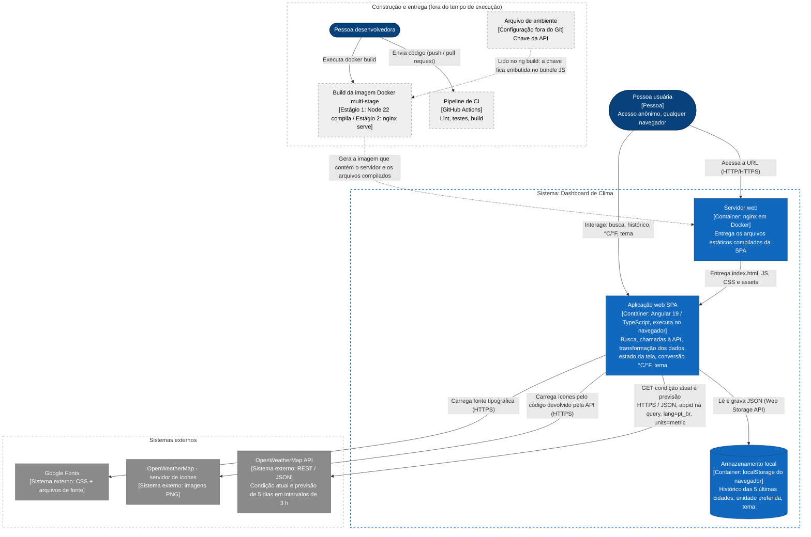
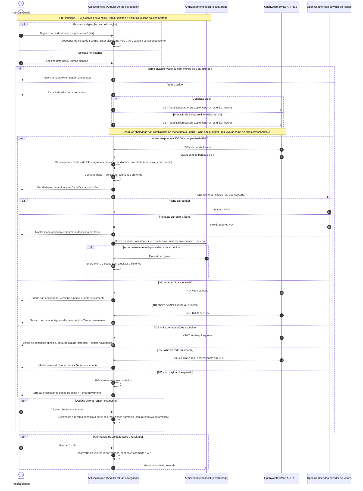

# Resposta bruta do modelo

Resposta ao prompt de [`prompt.md`](prompt.md), registrada **sem edição**. Ela serve de
linha de base: os diagramas ajustados estão em [`../diagrams/`](../diagrams/), e cada
diferença é explicada na seção "O que a IA inferiu, o que foi ajustado e por quê" do
[README](../README.md#9-o-que-a-ia-inferiu-o-que-foi-ajustado-e-por-quê).

> Os diagramas abaixo **não** representam o sistema real. Não use este arquivo como
> contexto de implementação.

---

## 1. Diagrama de containers (inspirado no C4 nível 2)

## 2. Diagrama de sequência: "consultar o clima de uma cidade"

## 3. Suposições

**Estrutura e integrações**

1. O armazenamento local é o `localStorage`, com valores serializados em JSON. Não é `sessionStorage` nem IndexedDB. Aparece como container porque a descrição o lista como peça, mas na prática faz parte do navegador.
2. Os endpoints são os do plano gratuito, `/data/2.5/weather` e `/data/2.5/forecast`, com a cidade passada pelo parâmetro `q`. Não se usa a API de geocodificação. A previsão devolve 40 pontos de 3 horas.
3. O navegador carrega os ícones direto do servidor de ícones da OpenWeatherMap, por uma URL montada com o código do ícone (padrão do tipo `.../img/wn/{código}@2x.png`). Não há proxy nem cópia local.
4. A OpenWeatherMap aceita requisições cross-origin (CORS) vindas do navegador, já que não existe backend próprio nem proxy.
5. O Google Fonts é carregado por um `<link>` no `index.html`. Se falhar, a interface usa uma fonte do sistema. Esse caminho não aparece na sequência porque não afeta a jornada.
6. O protocolo entre navegador e nginx fica como HTTP/HTTPS, porque não há ambiente de produção nem TLS definidos.
7. Uma consequência da restrição de build: a chave de API fica embutida no bundle JavaScript e qualquer pessoa que abrir a aplicação consegue vê-la. O diagrama registra esse fato, mas não decide se a chave deve ser protegida.
8. O repositório fica no GitHub, o que se deduz do uso do GitHub Actions. O pipeline roda a cada push ou pull request, faz lint, testes e build, e não gera nem publica a imagem Docker. O `docker build` é executado à mão. Como o CI obtém a chave (secret ou valor fictício) não está definido.

**Comportamento da jornada**

9. "Enquanto digita" quer dizer disparar a busca sozinha depois de um debounce (cerca de 500 ms), com mínimo de 2 caracteres. Não há lista de sugestões. O Enter dispara na hora. Uma nova digitação cancela a requisição pendente (padrão `switchMap`). Esses valores são arbitrários.
10. As duas chamadas (condição atual e previsão) saem em paralelo e o resultado é tudo ou nada: não se exibe resultado parcial.
11. O cliente usa um timeout de 10 segundos, porque o HttpClient do Angular não tem timeout padrão.
12. Não há retentativa automática, backoff nem cache de respostas, inclusive para o 429. Como a reação ao limite de requisições é uma lacuna, a opção mais simples foi mostrar a mensagem e deixar a pessoa tentar de novo.
13. Os erros são tratados pelo status HTTP (404, 401, 429, 5xx/status 0, payload inválido). As mensagens em pt-BR são sugestões. "Tentar novamente" aparece em todos os erros, incluindo o 404, como pede o escopo.
14. A mensagem de erro substitui a área de resultados, e o indicador de carregamento some em todos os ramos.
15. A cidade só entra no histórico quando a consulta dá certo. O histórico não tem duplicatas (comparação sem diferenciar maiúsculas), a mais recente fica em primeiro e o limite é 5. Falhas ao gravar no `localStorage` são ignoradas e não bloqueiam a tela.
16. A API sempre é chamada com `units=metric`, e a conversão para °F acontece no cliente (°F = °C × 9/5 + 32). Por analogia, o vento passa de m/s para mph. Trocar a unidade não gera nova requisição.
17. A previsão é agrupada por dia local da cidade usando o fuso (`timezone`) que a API devolve. Mínima e máxima saem dos pontos de 3 horas de cada dia, e o ícone do cartão é o do ponto mais perto do meio-dia (ou o mais frequente). O primeiro ou o último cartão pode representar um dia incompleto.
18. Nomes ambíguos ficam com a primeira correspondência que a API devolve. Não há desambiguação por país, a não ser que a pessoa digite algo como "Cidade,BR".
19. Na primeira visita, sem tema salvo, o tema segue a preferência do sistema (`prefers-color-scheme`) e a unidade começa em °C.
20. A jornada começa com a aplicação já carregada. A entrega dos arquivos pelo nginx aparece apenas no diagrama de containers.
